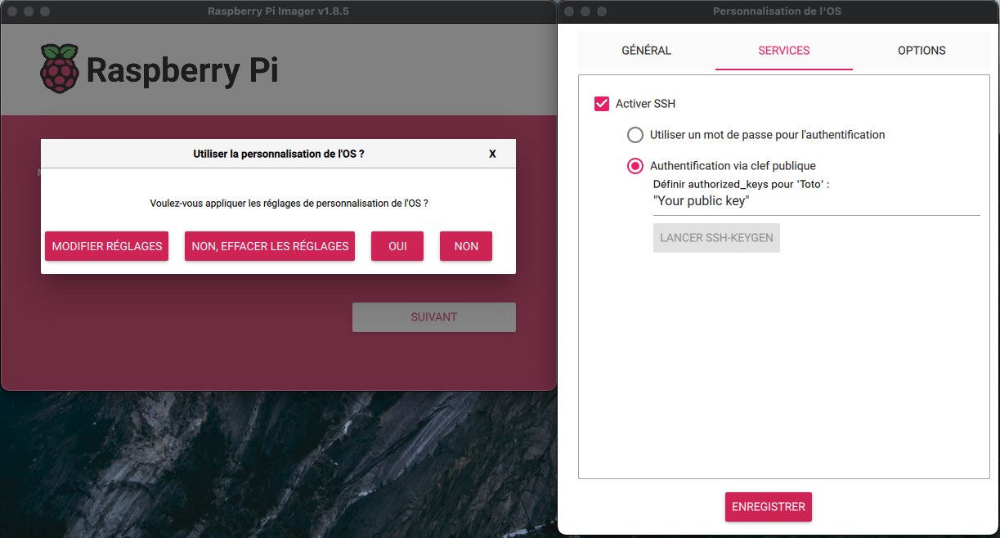

# Raspi_config_py
Tool to configure a Raspberry Pi with Ansible 

## -  Build 

On Mac it is necessary to install the SSL certificate : `/Applications/Python\ 3.11/Install\ Certificates.command ; exit;`

Run the script `build.py`, the output application is located in the `dist/` folder

## - Usage
sur Mac installer les certificat ssl
/Applications/Python\ 3.11/Install\ Certificates.command ; exit;
### It is necessary to build the image with [Raspberry Pi Imager](https://www.raspberrypi.org/downloads/) to customize the OS:
- #### General menu:
    * Hostname
    * User definition
    * WIFI setup
  


- #### Services menu:
  * Activation ssh 



#### Tip: Find the IP address of the pi and run an ssh cmd, this will add the pi to the authorized host and allow you to resolve the name

###  Configure the host file if necessary, default value:  
- "ansible_host": "raspberrypi"
- "ansible_port": 22
- "ansible_user": "pi"

### Configure the raspi_config_playbook.yml file
[Variable details](ansible/playbooks/roles/raspberry_pi_config/README.md)

```
---
- hosts:
    - pi
  become: true

  vars:
    rasp_extra_packages:
      - python3
    CAMERA: true
    rasp_ssh_port : 2222
    rasp_firewall: true
    rasp_open_firewall_port:
      - 80
      - 8080
  roles:
    - raspberry_pi_config

```


